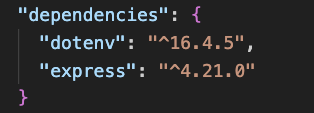
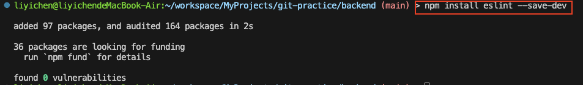
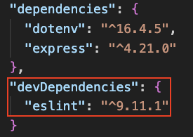
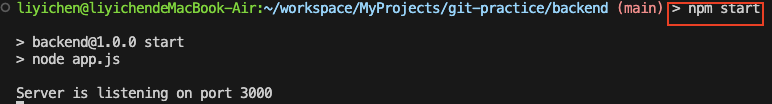

# Cloud native system development and maintenance HW3

## Table of Content

[A. AWS Region Concepts Introduction](https://github.com/Esther125/git-practice/tree/main/week-03#a-aws-concepts-introduction)

-   [x] [A.1 Introduction of AWS Region, AZ (availability zones)](https://github.com/Esther125/git-practice/tree/main/week-03#a1-introduction-of-aws-region--azs-availability-zones)
-   [x] [A.2 Which AWS region should I choose when using AWS services?](https://github.com/Esther125/git-practice/tree/main/week-03#a2-which-aws-region-should-i-choose-when-using-aws-services)

B. Callback & Promise Practice

-   [x] [B.1 Callback Function Practice](./callback.js)
-   [x] [B.2 (Advanced) Improve the previous practice with Promise](promise.js)

[C. Build Express Project](https://github.com/Esther125/git-practice/tree/main/week-03#c-build-express-project)

-   [x] [C.1 What are dependencies and devDependencies in `package.json`?](https://github.com/Esther125/git-practice/tree/main/week-03#c1-what-are-dependencies-and-devdependencies-in-packagejson)
-   [x] [C.2 How to use the scripts block in scripts `package.json`?](https://github.com/Esther125/git-practice/tree/main/week-03#c2-how-to-use-the-scripts-block-in-packagejson)
-   [x] [C.3 Verifying the Server is Running](https://github.com/Esther125/git-practice/tree/main/week-03#c3-verifying-the-server-is-running)
-   [x] [C.4 Modify the Port Number Using Environment Variables](https://github.com/Esther125/git-practice/tree/main/week-03#c4-modify-the-port-number-using-environment-variables)
-   [x] [C.5 Which files should be included in a GitHub repository and which should be excluded? Why?](https://github.com/Esther125/git-practice/tree/main/week-03#c5-which-files-should-be-included-in-a-github-repository-and-which-should-be-excluded-why)
-   [x] [C.6 Import modules in JavaScript: CJS vs ESM](https://github.com/Esther125/git-practice/tree/main/week-03#c6-import-modules-in-javascript-cjs-vs-esm)
    -   [x] [C.6.1 Introduction](https://github.com/Esther125/git-practice/tree/main/week-03#c61-introduction)
    -   [x] [C.6.2 How to use?](https://github.com/Esther125/git-practice/tree/main/week-03#c62-how-to-use)
-   [x] [C.7 (Advanced) What is localhost?](https://github.com/Esther125/git-practice/tree/main/week-03#c7-advanced-what-is-localhost)
-   [x] [C.8 (Advanced) Curl Introduction](https://github.com/Esther125/git-practice/tree/main/week-03#c8-advanced-curl-introduction)
    -   [x] [C.8.1 What is curl?](https://github.com/Esther125/git-practice/tree/main/week-03#c81-what-is-curl)
    -   [x] [C.8.2 How to use curl to test network connections?](https://github.com/Esther125/git-practice/tree/main/week-03#c82-how-to-use-curl-to-test-network-connections)
    -   [x] [C.8.3 What are the common parameters?](https://github.com/Esther125/git-practice/tree/main/week-03#c83-what-are-the-common-parameters)

D. Group Project

-   [x] d.1 [Group Members List](group.md)

## A. AWS Concepts Introduction

### A.1 Introduction of AWS Region & AZs (Availability Zones)


-   **Region:** A geographical area consisting of multiple isolated locations called Availability Zones. Each region operates independently to provide services.
-   **Availability Zones (AZs):** Independent and isolated data centers within a region, designed to ensure high availability and fault tolerance.
-   **Comparison:**

    | **Criteria**            | **Region**                                                                                                   | **Availability Zones (AZs)**                                                    |
    | ----------------------- | ------------------------------------------------------------------------------------------------------------ | ------------------------------------------------------------------------------- |
    | **Definition**          | A geographical area containing multiple AZs.                                                                 | Independent data centers within a region.                                       |
    | **When to Use**         | When you need to reduce latency, meet compliance, or optimize costs across different geographical locations. | When you need high availability and redundancy within the same region.          |
    | **Example (Region/AZ)** | **Region**: Asia Pacific (Tokyo)                                                                             | **AZ**: ap-northeast-1a, ap-northeast-1b                                        |
    | **Switching Cost**      | Yes, switching regions may incur different service pricing.                                                  | No, switching between AZs in the same region generally does not change pricing. |

### A.2 Which AWS region should I choose when using AWS services?

I will choose different regions based on what I prioritize:

1. **Latency:**

    If minimizing latency is my priority, I will choose a region **closer to my user base**.

    For example, if I am developing a game, I will select a region nearest to the majority of players to reduce response times.

2. **Regulatory Restrictions:**

    For tasks that are subject to specific regulatory requirements, I will select **a region that complies with these regulations**.

    For instance, financial applications might require data centers to be located within the country or a region that adheres to financial laws.

3. **Costs:**

    Budget is always a major concern since I am very poor, so I will choose regions that **offer lower service rates**.

    For example, the _US East (N. Virginia) region_ typically provides more affordable rates because it is close to AWS's headquarters and major data centers.

4. **Service Availability**:

    Not all AWS services are available in every region, especially the latest services and features. Before selecting an AWS region, I will ensure it offers the specific services I need.

To sum up, the factors I will take into consideration when choosing AWS Region are: **Latency, Regulation, Cost-efficiency and Service Availability**

## C. Build Express Project

### C.1 What are dependencies and devDependencies in package.json?

-   **Dependencies:** These are the packages required for your application to run **in production**. They are installed when you run `npm install [package-name]` and are essential for the app's core functionality.

    

-   **devDependencies:** These are the packages needed **only during development and testing**, such as testing frameworks or build tools. They are **not necessary** for the production environment. You can add new package to devDependencies by running `npm add [package-name] --save-dev`.

    For example, if I want to add `eslint` to my devDependencies, I need to use the following command:

    ```
    npm install eslint --save-dev
    ```

    

    Afterward, I can get the result like this:

    

### C.2 How to use the scripts block in package.json?

The scripts block in package.json defines custom commands that can be run using npm run. These scripts can automate tasks like starting the server, running tests, or building the project.

For example, you can define a start script with the following settings:


Then you can use the following command to replace `node app.js`

```
npm start
```



We can see that `npm start` can really replace the `node app.js` command.

### C.3 Verifying the Server is Running

I added a start script in the `package.json` file, allowing me to start the server using `npm start`. After running the command, I visited http://localhost:3000/ and saw the following output:


This confirms that the server is running successfully.

### C.4 Modify the Port Number Using Environment Variables

To make the port configurable through environment variables, follow these steps:

1. Create a `.env` file with the following content to define the port number:
    ```
    PORT=4000
    ```
2. Install dotenv by running the following command:
    ```
    npm install dotenv
    ```
3. Update `app.js` to load and set PORT environment variables:

    ```javascript
    // Use dotenv to load the environment variables in the .env file
    require("dotenv").config();

    const express = require("express");
    const app = express();
    // Use the PORT environment if it is defined
    // Otherwise, use the default port 3000
    const port = process.env.PORT || 3000;
    ```

    We can see the port runs on port 4000 now.

    

With this setup, you can easily change the port number by modifying the value in the `.env` file, **without having to alter the code in `app.js`**.

### C.5 Which files should be included in a GitHub repository and which should be excluded? Why?

I will include **essential files for collaboration**, such as source code, configuration files for consistent settings, and documentation like README.md to clarify the project's purpose and setup instructions.

On the other hand, files that include sensitive data such as `.env` and secret files should not be uploaded to Github. Unnecessary logs and cache files will also be omitted to streamline collaboration.

I only include necessary files to **keep the repo neat and clear**. And I exclude files with sensitive data for security purpose.

**(Supplementary)**

Although I do not upload `.env` file, I create another `example.env` file instead and I upload it to Github.

`example.env` file only include some environment variables that does not include sensitive data. This file can help my team members to set up `.env` file in a quick and convenient way. (As they just need to rename the `example.env` to `.env` then they can have most of the settings done.)

### C.6 Import modules in JavaScript: CJS vs ESM

### C.6.1 Introduction

In JavaScript, there are two import module systems: CommonJS (CJS) and ECMAScript Modules (ESM). The following table shows the difference of these two import modules:

| Feature                 | ESM (ECMAScript Modules)                                                                      | CommonJS (CJS)                                                   |
| ----------------------- | --------------------------------------------------------------------------------------------- | ---------------------------------------------------------------- |
| **Standard Age**        | Newer standard                                                                                | Older standard                                                   |
| **Syntax**              | Uses `import` and `export`                                                                    | Uses `require` and `module.exports` or `exports`                 |
| **Loading Time**        | **Static loading**, dependencies are resolved at **compile time**                             | **Dynamic loading**, modules are loaded on demand at **runtime** |
| **Runtime Environment** | Supported natively in modern JavaScript environments; modules are imported **asynchronously** | Primarily used in Node.js; modules are loaded **synchronously**  |
| **Compatibility**       | Incompatible with CJS modules                                                                 | Incompatible with ESM                                            |

### C.6.2 How to use?

**1. CommonJS (CJS)**:

-   use `require()` to import modules.
-   Use `module.exports` or `exports` to export modules.
-   Example:

    ```javascript
    // Filename: sayHello.js
    // Exporting in CJS
    module.exports = function sayHello() {
        console.log("Hello, CJS!");
    };
    ```

    ```javascript
    // Filename: app.js
    // Importing in CJS
    const sayHello = require("./sayHello");
    sayHello();
    ```

**2. ECMAScript Modules (ESM)**:

-   Use `import` to bring in modules.
-   Use `export` to define what should be accessible from the module.
-   _**NOTICE:** In Node.js, you'll need to set `"type": "module"` in your `package.json` to use ESM._
-   Example:

    ```javascript
    // Filename: sayHello.js
    // Exporting in ESM
    export function sayHello() {
        console.log("Hello, ESM!");
    }
    ```

    ```javascript
    // Filename: app.js
    // Importing in ESM
    import { sayHello } from "./sayHello.js";
    sayHello();
    ```

### C.7 (Advanced) What is localhost?

`localhost` refers to your **own computer's address**, typically mapped to `127.0.0.1`. It's used to access services running **locally**, allowing you to test applications on your machine without needing an external network.

### C.8 (Advanced) Curl Introduction

### C.8.1 What is curl?

`Curl` is a command-line tool commonly used to test APIs, download files, and troubleshoot network issues by **sending requests and receiving responses from servers**.

### C.8.2 How to use curl to test network connections?

You can use the following command to test a network connection:

```
curl http://example.com
```

This sends a basic GET request to the http://example.com and displays the response. You will see the result like this:


### C.8.3 What are the common parameters?

1. `-I`: Fetch only the headers of the response.

    

2. `-X [HTTP_METHOD]`: Specify the HTTP method (e.g., GET, POST).

    ```
    curl -X POST http://example.com
    ```

3. `-d [data]`: Send data with a POST request.

    ```
    curl -d "name=John" http://example.com
    ```

4. `-o [filename]`: Save the response to a file.

    ```
    curl -o output.html http://example.com
    ```

5. `-u [user:password]`: Use for basic authentication.
    ```
    curl -u username:password http://example.com
    ```

## Reference

-   https://www.techtarget.com/searchcloudcomputing/tip/Understand-AWS-Regions-vs-Availability-Zones
-   https://docs.aws.amazon.com/AWSEC2/latest/UserGuide/using-regions-availability-zones.html#concepts-available-regions
-   https://vocus.cc/article/649cc0e0fd89780001a7d34d
