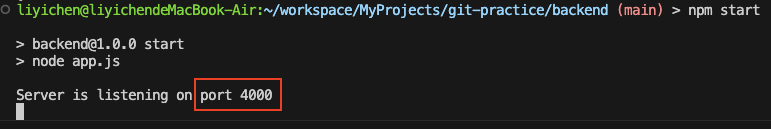

# Cloud native system development and maintenance HW3

## Table of Content

A. AWS Region Concepts Introduction

-   [x] A.1 Introduction of AWS Region, AZ (availability zones)
-   [x] A.2 Which AWS region should I choose when using AWS services?

B. Callback & Promise Practice

-   [x] B.1 [Callback Function Practice](./callback.js)
-   [x] B.2 (Advanced) [Improve the previous practice with Promise](promise.js)

C. Build Express Project

-   [x] C.1 What are dependencies and devDependencies in `package.json`?
-   [x] C.2 How to use the scripts block in scripts `package.json`?
-   [x] C.3 Verifying the Server is Running
-   [x] C.4 Modify the Port Number Using Environment Variables
-   [x] C.5 Which files should be included in a GitHub repository and which should be excluded? Why?
-   [x] C.6 Import modules in JavaScript: CJS vs ESM
    -   [x] C.6.1 Introduction
    -   [x] C.6.2 How to use?
-   [x] C.7 (Advanced) What is localhost?
-   [x] C.8 (Advanced) Curl Introduction
    -   [x] C.8.1 What is curl?
    -   [x] C.8.2 How to use curl to test network connections?
    -   [x] C.8.3 What are the common parameters?

D. Group Project

-   [x] d.1 [Group Members List](group.md)

## A. AWS Concepts Introduction

### A.1 Introduction of AWS Region & AZs (Availability Zones)


-   **Region:** A geographical area consisting of multiple isolated locations called Availability Zones. Each region operates independently to provide services.
-   **Availability Zones (AZs):** Independent and isolated data centers within a region, designed to ensure high availability and fault tolerance.
-   **Comparison:**

    | **Criteria**            | **Region**                                                                                                   | **Availability Zones (AZs)**                                                    |
    | ----------------------- | ------------------------------------------------------------------------------------------------------------ | ------------------------------------------------------------------------------- |
    | **Definition**          | A geographical area containing multiple AZs.                                                                 | Independent data centers within a region.                                       |
    | **When to Use**         | When you need to reduce latency, meet compliance, or optimize costs across different geographical locations. | When you need high availability and redundancy within the same region.          |
    | **Example (Region/AZ)** | **Region**: Asia Pacific (Tokyo)                                                                             | **AZ**: ap-northeast-1a, ap-northeast-1b                                        |
    | **Switching Cost**      | Yes, switching regions may incur different service pricing.                                                  | No, switching between AZs in the same region generally does not change pricing. |

### A.2 Which AWS region should I choose when using AWS services?

-   **Gaming Industry**

    -   Key factor: **Latency**
    -   Region: Select a region **close to your primary player base** to reduce response time.
    -   Example: If most of your players are in Asia, choose a region like _Asia Pacific (Tokyo)_ or _Asia Pacific (Seoul)_ to provide a better gaming experience.

-   **Financial Sector**

    -   Key factor: **Regulation**
    -   Region: Choose a **region where the data center is located within your country** or where the **financial regulations allow**.

-   **Startups and Individual Users**

    -   Key factor: **Cost-efficiency**
    -   Region: Opt for regions that offer **lower pricing**
    -   Example: Regions like _US East (N. Virginia)_ typically provide more affordable service rates since the region is close to AWS's headquarters and major data centers.

-   **Important factors for every industry and user**

    -   **Service Availability**

        Not all AWS services are available in every region, particularly newer services or advanced features. Before selecting an AWS region, it's important to verify that the region offers the specific services you need.

    -   **Disaster Recovery & Fault Tolerance**
        If your application requires high availability and fault tolerance, selecting an AWS region with multiple AZs is crucial.

To sum up, the factors we need to take into consideration when choosing AWS Region are: **Latency, Regulation, Cost-efficiency, Service Availability and Disaster Recovery & Fault Tolerance.**

## C. Build Express Project

### C.1 What are dependencies and devDependencies in package.json?

-   Dependencies: These are the packages required for your application to run in production. They are installed when you run npm install and are essential for the app's core functionality.

    ```
    "dependencies": {
        "express": "^4.17.1"
    }
    ```

-   devDependencies: These are the packages needed only during development, such as testing frameworks or build tools. They are installed with npm install --save-dev and are not necessary for the production environment.

    ```
    "devDependencies": {
        "jest": "^27.0.0"
    }
    ```

### C.2 How to use the scripts block in package.json?

The scripts block in package.json defines custom commands that can be run using npm run. These scripts can automate tasks like starting the server, running tests, or building the project. For example, you can define a start script with the following settings:


Then you can use the following command to replace `node app.js`

```
npm start
```

### C.3 Verifying the Server is Running

I added a start script in the `package.json` file, allowing me to start the server using `npm start`. After running the command, I visited http://localhost:3000/ and saw the following output:


This confirms that the server is running successfully.

### C.4 Modify the Port Number Using Environment Variables

To make the port configurable through environment variables, follow these steps:

1. Create a .env file with the following content to define the port number:
    ```
    PORT=4000
    ```
2. Install dotenv by running the following command:
    ```
    npm install dotenv
    ```
3. Update `app.js` to load environment variables and set the port:

    ```
    // Load dotenv to use the settings in the .env file
    require("dotenv").config();

    // Set the default port to 3000
    // If a port is defined in the .env file, use that value instead
    const port = process.env.PORT || 3000;
    ```



With this setup, you can easily change the port number by modifying the value in the `.env` file, **without having to alter the code in `app.js`**.

### C.5 Which files should be included in a GitHub repository and which should be excluded? Why?

-   Include:
    -   Source code (.js, .py, etc.)
    -   Configuration files (package.json, docker-compose.yml, etc.)
    -   Documentation (README.md)
    -   Important scripts and assets (images, stylesheets)
-   Exclude:

    -   Sensitive data (.env, API keys)
    -   Dependencies (node_modules, vendor)
    -   Build outputs (dist, build)
    -   Temporary files (logs, caches)

-   Why?
    -   Including relevant files ensures collaboration, version control, and project transparency.
    -   Excluding unnecessary or sensitive files protects security, reduces repo size, and avoids redundant data (like libraries or build artifacts that can be generated locally).

### C.6 Import modules in JavaScript: CJS vs ESM

#### C.6.1 Introduction

In JavaScript, there are two main module systems: CommonJS (CJS) and ECMAScript Modules (ESM).

-   **CJS**: Older standard used primarily in Node.js, where modules are loaded synchronously using `require()`.
-   **ESM**: Newer standard supported natively in modern JavaScript environments, where modules are imported **asynchronously** using `import` and `export` statements.

#### C.6.2 How to use?

**1. CommonJS (CJS)**:

-   use `require()` to import modules.
-   Use `module.exports` or `exports` to export modules.
-   Example:

    ```javascript
    // Exporting in CJS
    module.exports = function sayHello() {
        console.log("Hello, CJS!");
    };

    // Importing in CJS
    const sayHello = require("./sayHello");
    sayHello();
    ```

**2. ECMAScript Modules (ESM)**:

-   Use `import` to bring in modules.
-   Use `export` to define what should be accessible from the module.
-   Example:

        ```javascript
        // Exporting in ESM
        export function sayHello() {
            console.log("Hello, ESM!");
        }

        // Importing in ESM
        import { sayHello } from "./sayHello.js";
        sayHello();
        ```

    _Note: In Node.js, you'll need to set "type": "module" in your package.json to use ESM._

### C.7 (Advanced) What is localhost?

Localhost refers to your **own computer's address**, typically mapped to `127.0.0.1`. It's used to access services running **locally**, allowing you to test applications on your machine without needing an external network.

### C.8 (Advanced) Curl Introduction

#### C.8.1 What is curl?

`Curl` is a command-line tool commonly used to test APIs, download files, and troubleshoot network issues by **sending requests and receiving responses from servers**.

#### C.8.2 How to use curl to test network connections?

You can use the following command to test a network connection:

```
curl http://example.com
```

This sends a basic GET request to the http://example.com and displays the response. You will see the result like this:


#### C.8.3 What are the common parameters?

1. `-I`: Fetch only the headers of the response.

    

2. `-X [HTTP_METHOD]`: Specify the HTTP method (e.g., GET, POST).

    ```
    curl -X POST http://example.com
    ```

3. `-d [data]`: Send data with a POST request.

    ```
    curl -d "name=John" http://example.com
    ```

4. `-o [filename]`: Save the response to a file.

    ```
    curl -o output.html http://example.com
    ```

5. `-u [user:password]`: Use for basic authentication.
    ```
    curl -u username:password http://example.com
    ```

## Reference

-   https://www.techtarget.com/searchcloudcomputing/tip/Understand-AWS-Regions-vs-Availability-Zones
-   https://docs.aws.amazon.com/AWSEC2/latest/UserGuide/using-regions-availability-zones.html#concepts-available-regions
