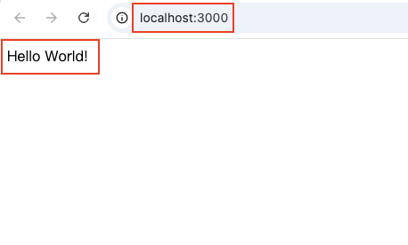

# Cloud native system development and maintenance HW3

## Table of Content

-   [ ] A. AWS Region Concepts Introduction
    -   [ ] Introduction of AWS Region, AZ (availability zones)
    -   [ ] Which AWS region should I choose when using AWS services, and what factors should I consider?
-   [x] B. Callback & Promise Practice
    -   [x] [Callback Function Practice](./callback.js)
    -   [x] (Advanced) [Improve the previous practice with Promise](promise.js)
-   [ ] C. Build Express Project
    -   [x] Build [backend folder](/backend/)
    -   [x] npm init
    -   [x] npm install express
    -   [ ] Observations of `package.json` & `node_modules`
    -   [x] Build `app.js`
    -   [x] Verifying the Server is Running
    -   [x] Modify the Port Number Using Environment Variables
-   [ ] Observations and usages of `package.json`
    -   [ ] What are dependencies and devDependencies in `package.json`?
    -   [ ] How to use the scripts block in scripts `package.json`?
-   [ ] Best practices for managing files in a GitHub repository
    -   [ ] Which files should be included in a GitHub repository and which should be excluded?
    -   [ ] Why?
-   [ ] Import modules in JavaScript: CJS vs ESM
    -   [ ] Introduction
    -   [ ] How to use?
-   [ ] (Advanced) What is localhost?
-   [ ] (Advanced) Curl Introduction
    -   [ ] What is curl?
    -   [ ] How to use curl to test network connections?
    -   [ ] What are the common parameters?

## C. Build Express Project

### Observations of `package.json` & `node_modules`

### Verifying the Server is Running

I added a start script in the `package.json` file, allowing me to start the server using `npm start`. After running the command, I visited http://localhost:3000/ and saw the following output:



This confirms that the server is running successfully.

### Modify the Port Number Using Environment Variables

To make the port configurable through environment variables, follow these steps:

1. Create a .env file with the following content to define the port number:
    ```
    PORT=4000
    ```
2. Install dotenv by running the following command:
    ```
    npm install dotenv
    ```
3. Update `app.js` to load environment variables and set the port:

    ```
    // Load dotenv to use the settings in the .env file
    require("dotenv").config();

    // Set the default port to 3000
    // If a port is defined in the .env file, use that value instead
    const port = process.env.PORT || 3000;
    ```


With this setup, you can easily change the port number by modifying the value in the `.env` file, **without having to alter the code in `app.js`**.
