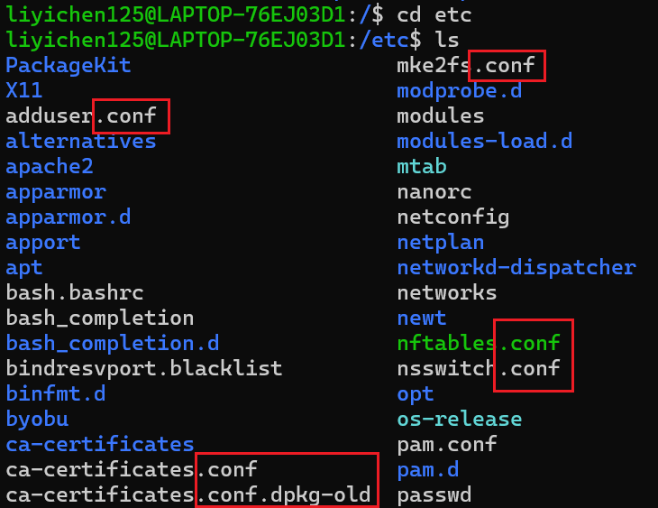
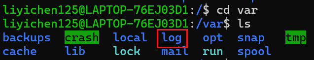
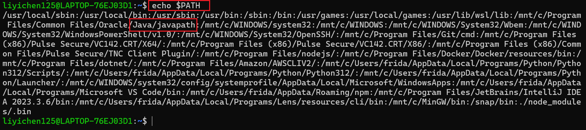
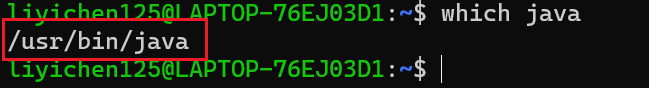

# Cloud native system development and maintenance HW4

## Table of Content

A. Linux File System Directory Structure Introduction

-   [x] [A.1 `/etc`](#a1-etc)
-   [x] [A.2 `/var`](#a2-var)
-   [x] [A.3 `/boot`](#a3-boot)
-   [x] [A.4 `$PATH` environment variable](#a4-path-environment-variable)
-   [x] [A.5 `which` command](#a5-which-command)

B. Lab: Setting up an EC2 Instance and Deploying a Web Server

-   [x] [B.1 Check the public IP of the instance is running](#b1-check-the-public-ip-of-the-instance-is-running)
-   [x] [B.2 What is an instance type?](#b2-what-is-an-instance-type)
-   [x] [B.3 What is Nginx? What are its uses and features?](#b3-what-is-nginx-what-are-its-uses-and-features)
-   [x] [B.4 What is the pm2 package? What is it used for?](#b4-what-is-the-pm2-package-what-is-it-used-for)
-   [x] [B.5 What is meant by `proxy` as mentioned in step 9? Why use Nginx to proxy to a web server developed with Express? (Hint: Reverse proxy vs Forward Proxy)](#b5-what-is-meant-by-proxy-as-mentioned-in-step-9-why-use-nginx-to-proxy-to-a-web-server-developed-with-express-hint-reverse-proxy-vs-forward-proxy)
-   [x] [B.6 Provide the Nginx configuration file from step 9 in the readme.](#b6-provide-the-nginx-configuration-file-from-step-9-in-the-readme)
-   [x] [B.7 What is a Security Group? What is its purpose? Are there any guidelines for setting it up?](#b7-what-is-a-security-group-what-is-its-purpose-are-there-any-guidelines-for-setting-it-up)
-   [x] [B.8 What is sudo? Why do you sometimes need to add sudo, and other times you do not?](#b8-what-is-sudo-why-do-you-sometimes-need-to-add-sudo-and-other-times-you-do-not)
-   [x] [B.9 Where are the Nginx log files located? How did you find them? How do you view the Nginx logs?](#b9-where-are-the-nginx-log-files-located-how-did-you-find-them-how-do-you-view-the-nginx-logs)
-   [x] [B.10 Any other issues you encountered during the process?](#b10-any-other-issues-you-encountered-during-the-process)
-   [x] [B.11 References](#b11-references)

## A. Linux File System Directory Structure Introduction

### A.1 `/etc`

The full name of `/etc` is **Editable Text Config**. This directory save the config files for the software and therefore there are lots of files end with `.conf` in the file.



### A.2 `/var`

This directory containes the variable files that will change when the OS is being used, such as `log`.



### A.3 `/boot`

The directory cantains the files to boot the system such as the linux kernal.

### A.4 `$PATH` environment variable

`$PATH` can map all the user binaries, enabling you to execute the user binaries in any directory in the terminal.

(Example) I previously downloaded an application called ngrok. After downloading the binary, I had to add the path of ngrok to the `$PATH` environment variable. This adjustment ensured that when I used the ngrok command in the root terminal, it correctly located and executed ngrok from the specified path, allowing me to successfully run the application.

You can use the following command to check your `$PATH` varible:

```
echo $PATH
```



I can see the path of java binary is already in the `$PATH` varible.

### A.5 `which` command

By running the following command, you can get the full path of a specific binary:

```
which [BINARY_NAME]
```

For example, if I want to know the full path of my java binary:



## B. Lab: Setting up an EC2 Instance and Deploying a Web Server

### B.1 Check the public IP of the instance is running

### B.2 What is an instance type?

### B.3 What is Nginx? What are its uses and features?

### B.4 What is the pm2 package? What is it used for?

### B.5 What is meant by `proxy` as mentioned in step 9? Why use Nginx to proxy to a web server developed with Express? (Hint: Reverse proxy vs Forward Proxy)

### B.6 Provide the Nginx configuration file from step 9 in the readme.

### B.7 What is a Security Group? What is its purpose? Are there any guidelines for setting it up?

### B.8 What is sudo? Why do you sometimes need to add sudo, and other times you do not?

### B.9 Where are the Nginx log files located? How did you find them? How do you view the Nginx logs?

### B.10 Any other issues you encountered during the process?

### B.11 References
