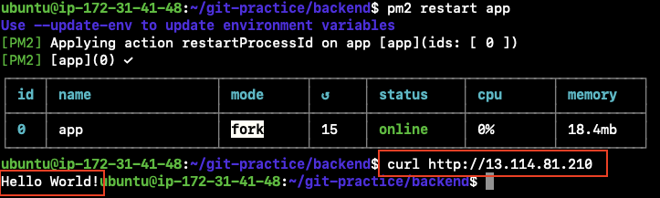
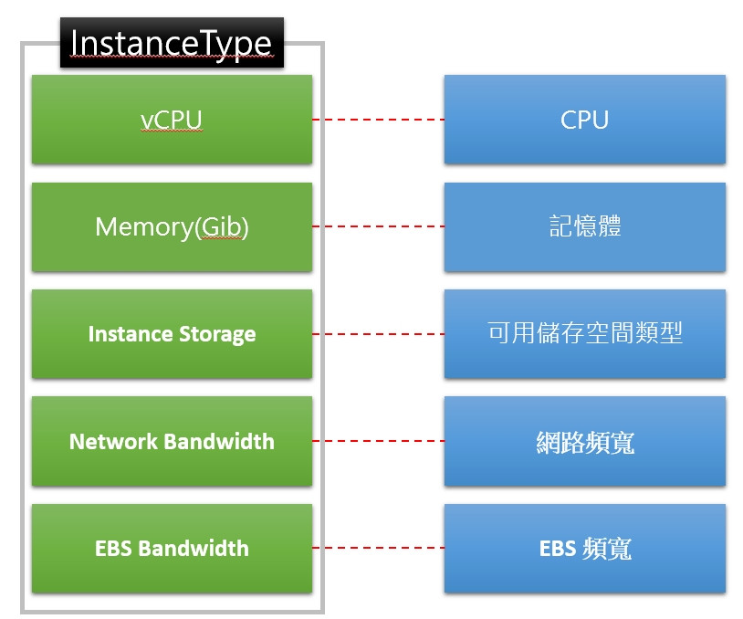
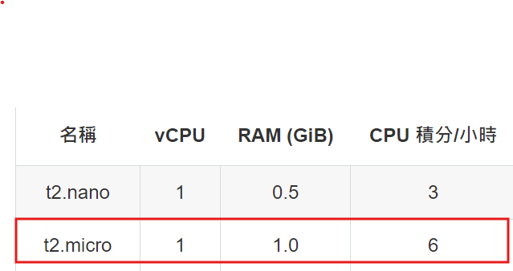
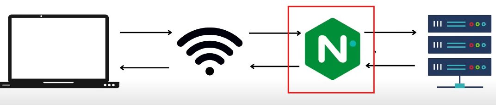
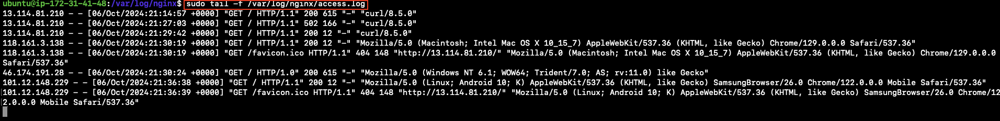

# Cloud native system development and maintenance HW4

## Table of Content

A. Linux File System Directory Structure Introduction

-   [x] [A.1 `/etc`](#a1-etc)
-   [x] [A.2 `/var`](#a2-var)
-   [x] [A.3 `/boot`](#a3-boot)
-   [x] [A.4 `$PATH` environment variable](#a4-path-environment-variable)
-   [x] [A.5 `which` command](#a5-which-command)

B. Lab: Setting up an EC2 Instance and Deploying a Web Server

-   [x] [B.1 Check the public IP of the instance is running](#b1-check-the-public-ip-of-the-instance-is-running)
-   [x] [B.2 What is an instance type?](#b2-what-is-an-instance-type)
-   [x] [B.3 What is Nginx? What are its uses and features?](#b3-what-is-nginx-what-are-its-uses-and-features)
-   [x] [B.4 What is the pm2 package? What is it used for?](#b4-what-is-the-pm2-package-what-is-it-used-for)
-   [x] [B.5 What is meant by `proxy` as mentioned in step 9? Why use Nginx to proxy to a web server developed with Express? (Hint: Reverse proxy vs Forward Proxy)](#b5-what-is-meant-by-proxy-as-mentioned-in-step-9-why-use-nginx-to-proxy-to-a-web-server-developed-with-express-hint-reverse-proxy-vs-forward-proxy)
-   [x] [B.6 Provide the Nginx configuration file from step 9 in the readme.](#b6-provide-the-nginx-configuration-file-from-step-9-in-the-readme)
-   [x] [B.7 What is a Security Group? What is its purpose? Are there any guidelines for setting it up?](#b7-what-is-a-security-group-what-is-its-purpose-are-there-any-guidelines-for-setting-it-up)
-   [x] [B.8 What is sudo? Why do you sometimes need to add sudo, and other times you do not?](#b8-what-is-sudo-why-do-you-sometimes-need-to-add-sudo-and-other-times-you-do-not)
-   [x] [B.9 Where are the Nginx log files located? How did you find them? How do you view the Nginx logs?](#b9-where-are-the-nginx-log-files-located-how-did-you-find-them-how-do-you-view-the-nginx-logs)
-   [x] [B.10 Any other issues you encountered during the process?](#b10-any-other-issues-you-encountered-during-the-process)
-   [x] [B.11 References](#b11-references)

## A. Linux File System Directory Structure Introduction

### A.1 `/etc`

The full name of `/etc` is **Editable Text Config**. This directory save the config files for the software and therefore there are lots of files end with `.conf` in the file.


### A.2 `/var`

This directory containes the variable files that will change when the OS is being used, such as `log`.


### A.3 `/boot`

The directory cantains the files to boot the system such as the linux kernal.

### A.4 `$PATH` environment variable

`$PATH` can map all the user binaries, enabling you to execute the user binaries in any directory in the terminal.

(Example) I previously downloaded an application called ngrok. After downloading the binary, I had to add the path of ngrok to the `$PATH` environment variable. This adjustment ensured that when I used the ngrok command in the root terminal, it correctly located and executed ngrok from the specified path, allowing me to successfully run the application.

You can use the following command to check your `$PATH` varible:

```
echo $PATH
```


I can see the path of java binary is already in the `$PATH` varible.

### A.5 `which` command

By running the following command, you can get the full path of a specific binary:

```
which [BINARY_NAME]
```

For example, if I want to know the full path of my java binary:


## B. Lab: Setting up an EC2 Instance and Deploying a Web Server

### B.1 Check the public IP of the instance is running

My Public IP: http://13.114.81.210/



### B.2 What is an instance type?

An instance type specifies a configuration of CPU, memory, storage, and other resources available to a virtual machine in a cloud environment. Users can select different instance types based on their needs. An instance type contains the resources below:



Image Source: https://ithelp.ithome.com.tw/m/articles/10295411

The instance type I use in this lab is `t2.micro`. The configurations of this instance type is:



### B.3 What is Nginx? What are its uses and features?


Image Source: https://www.youtube.com/watch?v=7VAI73roXaY

Nginx is a lightweight **web server** that can also serve the following roles:

1.  **Reverse Proxy**

    As a reverse proxy, Nginx allows you to manage the following tasks centrally, without needing to configure them on each individual server:

    -   Load SSL/TLS certificates to enable HTTPS connections
    -   Mitigate DDoS attacks

2.  **Load Balancer**
3.  Http Cache (replaced by CDN)

Key Features of Nginx: efficiency, scalability, security

### B.4 What is the pm2 package? What is it used for?

`pm2` is a production **process manager** for Node.js applications with a built-in load balancer. It allows you to **keep applications alive forever**, to reload them without downtime and to facilitate common system admin tasks.

### B.5 What is meant by `proxy` as mentioned in step 9? Why use Nginx to proxy to a web server developed with Express? (Hint: Reverse proxy vs Forward Proxy)

### B.6 Provide the Nginx configuration file from step 9 in the readme.

```
server {
    listen 80;
    server_name 13.114.81.210;

    location / {
        proxy_pass http://localhost:3000;
        proxy_http_version 1.1;
        proxy_set_header Upgrade $http_upgrade;
        proxy_set_header Connection 'upgrade';
        proxy_set_header Host $host;
        proxy_cache_bypass $http_upgrade;
    }
}
```

### B.7 What is a Security Group? What is its purpose? Are there any guidelines for setting it up?

A Security Group acts as a **virtual firewall** that filters inbound and outbound traffic at the instance level. You can add rules to each security group that **allow specific ranges of IPs and ports** to reach its associated instances. The purpose of a Security Group is to **control access** to an instance from external networks, ensuring that only authorized traffic can access or leave the instance. (By default, if the inbound traffic can access the instance, the outbound should be allowed, too.)

In the lab, we set inbound rules for ports 22 and 80, which means allowing traffic on these ports.

By opening port 80, the instance can serve web pages or run web-based applications via HTTP connections. By opening port 22, we enable SSH connections, allowing secure remote management of the instance.

### B.8 What is sudo? Why do you sometimes need to add sudo, and other times you do not?

`sudo` stands for "superuser do." It allows you to execute commands with **administrative privileges**.

When I need greater permissions to run a command, I start the command with sudo. I don't use sudo for routine commands to avoid having excessive permissions, which could lead to errors.

### B.9 Where are the Nginx log files located? How did you find them? How do you view the Nginx logs?

In part A. Linux File System Directory Structure Introduction, I learned that `log` directory is located under the `/var` folder, and therefore I checked the folder first and then found that Nginx log files located at the path: `/var/log/nginx`

There are two logs files: `access.log` & `error.log`

-   `access.log` records every request sent to Nginx
-   `error.log` records errors when nginx is handling requests

I can view log with command:

```shell
# tail: outputs the last 10 lines of the file
# `-f`: tail remains active and continues to output new content appended to the end of the file
sudo tail -f /var/log/nginx/access.log
```



### B.10 Any other issues you encountered during the process?

No

### B.11 References

-   https://ithelp.ithome.com.tw/m/articles/10295411
-   https://www.youtube.com/watch?v=42iQKuQodW4
-   https://aws.amazon.com/tw/ec2/instance-types/t2/
-   https://www.youtube.com/watch?v=7VAI73roXaY
-   https://kucw.io/blog/nginx/
-   https://zh.wikipedia.org/zh-tw/Sudo
-   https://ithelp.ithome.com.tw/articles/10237747
-   https://medium.com/@awseducate.cloudambassador/%E6%8A%80%E8%A1%93%E5%88%86%E4%BA%AB-security-group%E5%92%8Ciam%E7%9A%84%E5%B7%AE%E5%88%A5%E7%82%BA%E4%BD%95-942d303565b7
-   GPT-4
