# Troubleshooting Lab

## 除錯過程紀錄

一開始由以下語法發現 `/etc/nginx/nginx.conf` 設定檔有語法錯誤

```
sudo systemctl status nginx
```

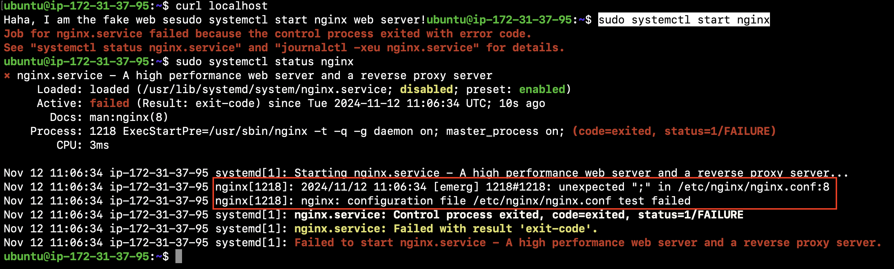

進入設定檔將多餘的分號刪掉，試圖解決語法錯誤

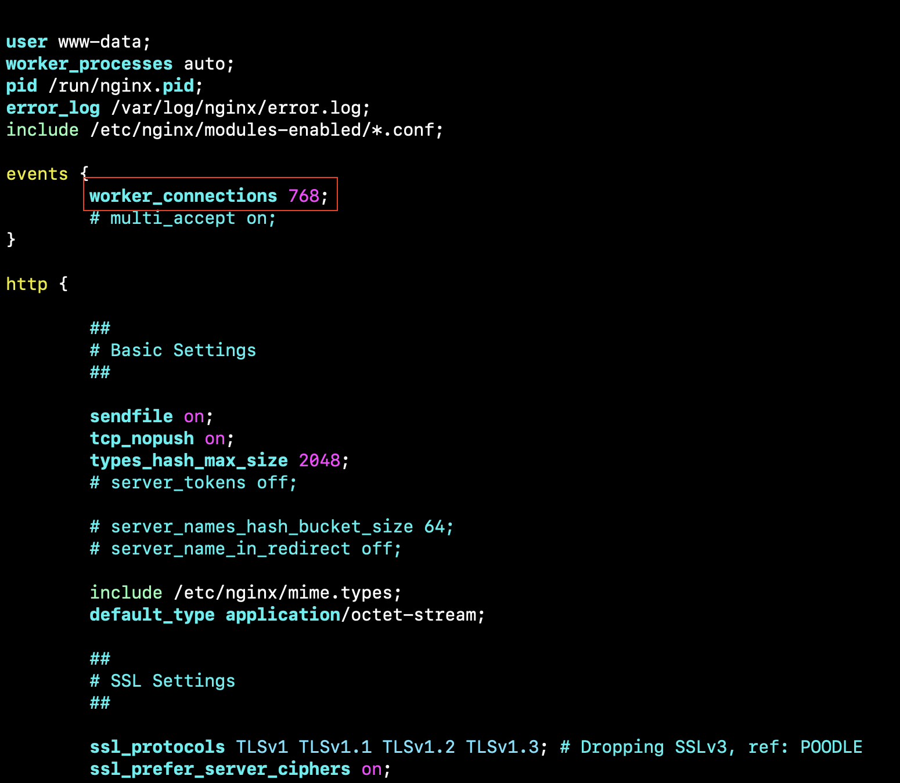

更改後，要存檔時出現錯誤，發現有可能是 file system full

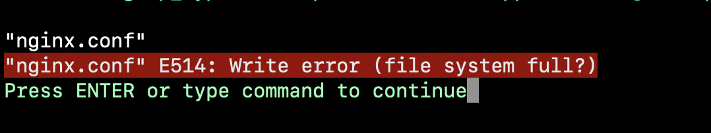

列出使用 disk 最多的幾個檔案

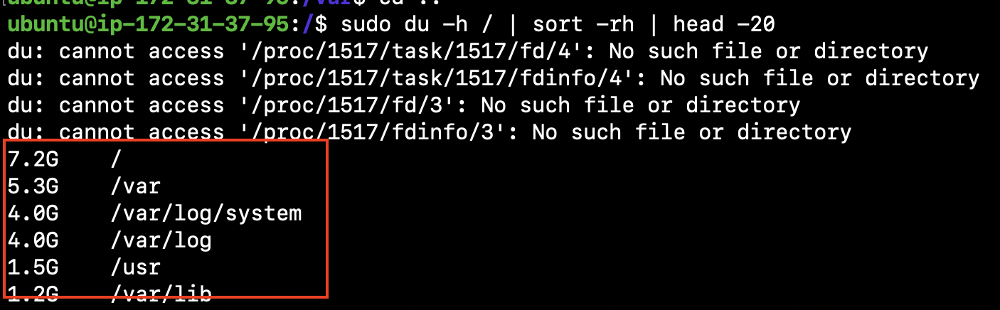

去以上路徑找尋有沒有可以刪除的檔案，發現幾個應該要被刪除的大檔案

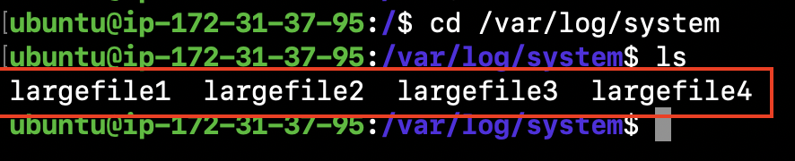

使用以下指令刪除大檔案

```
sudo rm
largefilel largefile2 largefile3 largefile4
```

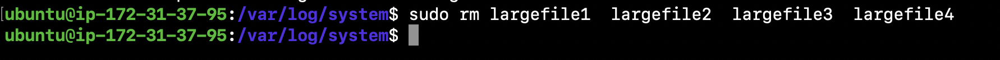

重新啟動 nginx 發現還是 failed 因為 port 80 被佔用

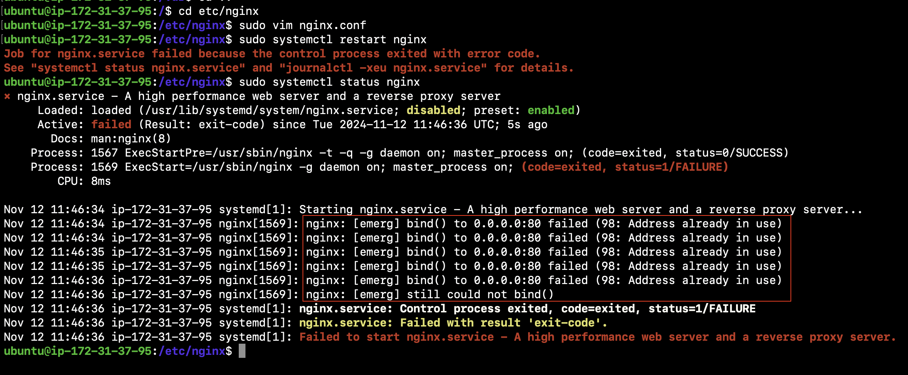

用以下指令觀察哪個 process 佔用 port 80，把佔用的 port 砍掉

```
sudo lsof -i :80
```

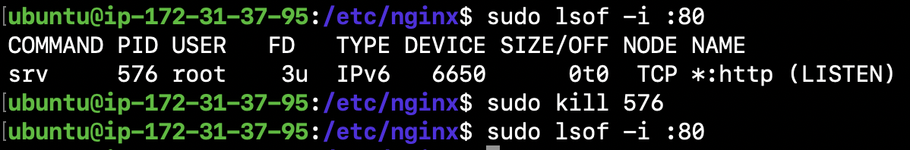

砍掉以後重新啟動 nginx，發現已經可以正常運作，但 `curl localhost` 仍然出現錯誤

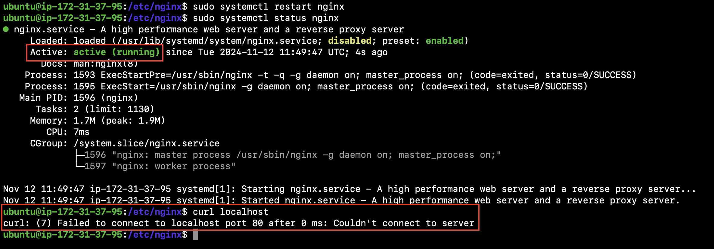

利用以下指令查看防火牆的設定規則

```
sudo iptables -L
```

發現有一條拒絕 http 連線的規則

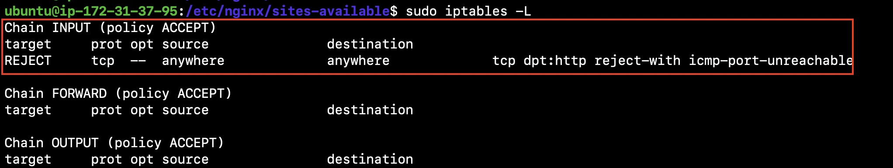

用以下指令將該規則刪除

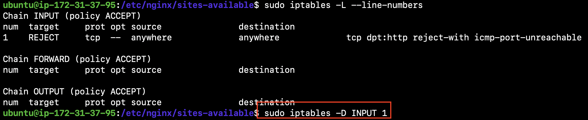

就可以正常 curl 到 localhost 了！

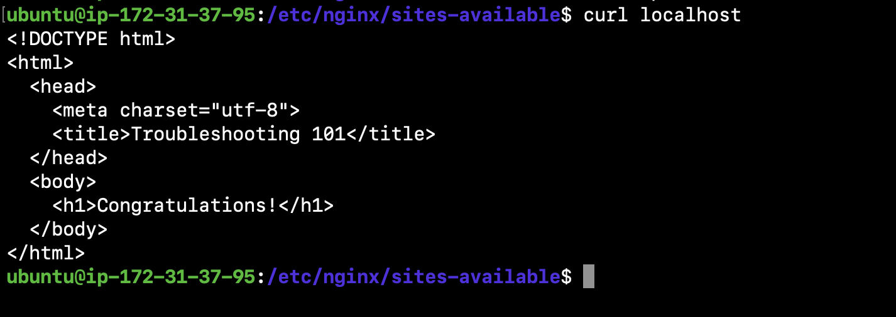

## 心得 & 收穫

我很喜歡這次 lab 的體驗，感覺很接近業界實務上在 debug 的過程，過程中靠自己一步一步解決不同的問題讓我覺得很有成就感，也覺得很好玩～有些地方是原本靠自己想想不到解決方法的（例如最後一個防火牆規則，我本來完全沒有聯想到可能是那邊出錯），但靠跟組員討論，或看 discord 上別組給的提示最後才成功也解出來，感覺 SRE 的工作很有挑戰性，但也滿吃經驗的，有些小關卡有踩過類似的坑下次應該都可以很快解決出來。原本對 SRE 這個職位沒什麼想法，但經過這次經驗以後有機會也會想嘗試看看！

在做這次作業的過程中給我最大的收穫應該是訓練了我 debug 的敏銳度跟邏輯，過程中有時候被卡住一開始會亂試，但後來就知道應該沉住氣仔細找線索或重新把邏輯想過一遍，這樣會有效率很多，以後我再遇到類似的情境我相信我可以更快找出解答！
